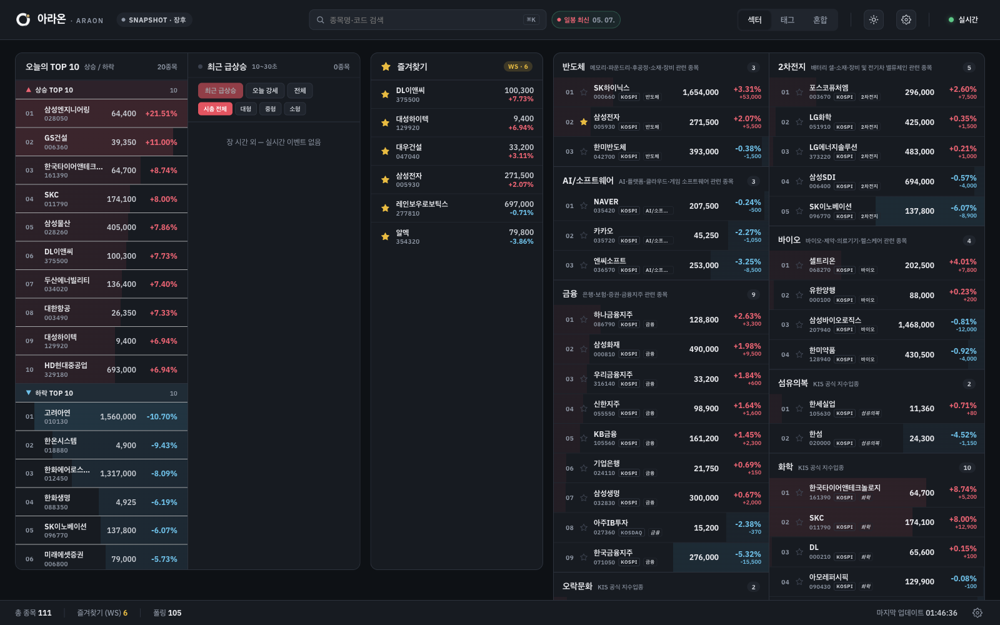
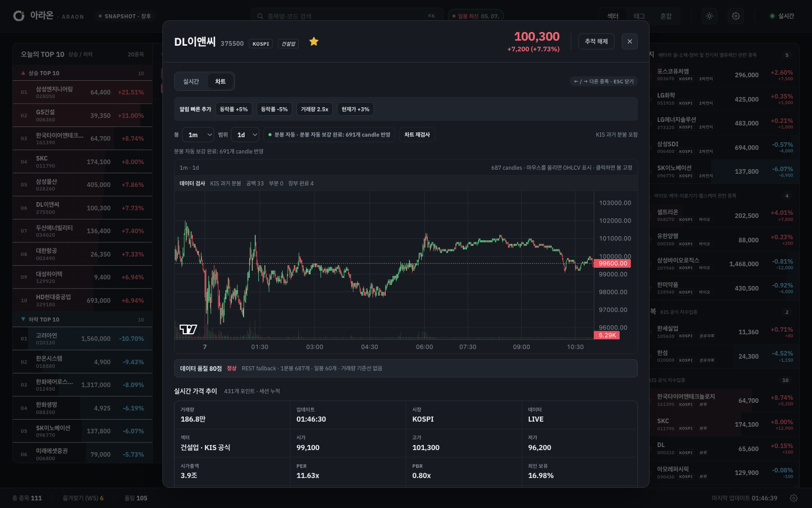

# Araon

<p align="center">
  <picture>
    <source media="(prefers-color-scheme: dark)" srcset="public/logo-dark.png">
    
  </picture>
</p>

<p align="center">
  Trade on your phone. Keep Araon open on the side.
</p>

<p align="center">
  <a href="README.ko.md">한국어</a>
  ·
  <a href="INSTALL.md">Install guide</a>
  ·
  <a href="https://github.com/StelloJae/Araon/releases/tag/v1.1.2">v1.1.2 release</a>
</p>

<p align="center">
  
  
  
</p>

Araon is a personal observation dashboard for Korean stock traders who want a
quiet second screen. It runs on your own machine, connects to KIS OpenAPI with
your credentials, and keeps the names you care about visible during the trading
day.

It is not a broker, trading bot, or advisory product. Araon never places orders
and does not manage your account. The intent is simple: keep the important
market context visible while you make decisions somewhere else.

## Preview





[Watch a short demo](docs/assets/demo/araon-flow.mp4)

## Who It Is For

Araon is built for people who:

- trade from a phone or brokerage app but want a dedicated monitoring screen
- follow a small set of Korean stocks during fast sessions
- want realtime movement, charts, news, disclosures, and alerts in one place
- prefer a read-only local tool that stores runtime data on their own machine

## What It Does

Araon keeps a local watchlist and combines the views that matter while you are
watching the market:

- realtime KIS integrated quotes for up to 40 tracked/favorite stocks
- REST polling fallback when realtime data is quiet or unavailable
- intraday price movement and persisted local candle history
- KIS daily candle backfill for 1D, 1W, and 1M chart views
- selected-ticker today-minute backfill when the guarded route allows it
- news and disclosure links, with optional Naver Search and OpenDART enrichment
- local, desktop, sound, and optional Telegram alerts
- data-health diagnostics so you can see what Araon is collecting

All runtime data stays local. Fresh installs do not contact KIS until you add
credentials.

## First Five Minutes

```txt
1. Run npx @stellojae/araon
2. Open the localhost page
3. Enter your KIS app key and app secret
4. Add your first stock from search
5. Open the stock modal and check realtime, chart, news, and disclosures
```

If you do not have a KIS key yet, start with the
[KIS OpenAPI setup guide](docs/guides/kis-openapi-setup.md).

## Install

You need Node.js 20 or newer.

The quickest way to try Araon is:

```bash
npx @stellojae/araon
```

Araon starts a local server and prints a `http://127.0.0.1:<port>` address. It
will also try to open the browser for you.

If you plan to use it regularly:

```bash
npm install -g @stellojae/araon
araon
```

On first launch, Araon asks for your live KIS OpenAPI app key and app secret.
Until those are saved locally, KIS realtime, polling, master refresh, and
backfill remain inactive.

## First Setup

1. Run `npx @stellojae/araon`.
2. Open the localhost URL if the browser does not open automatically.
3. Enter your KIS OpenAPI credentials.
4. Add stocks through search.
5. Mark the names you care about as favorites.
6. Leave Araon running while you monitor the market.

After credentials are configured, Araon manages the normal monitoring workflow
for you:

- integrated realtime quotes are enabled
- REST polling remains available as fallback
- daily candle backfill runs outside market hours

You can pause realtime or backfill from Settings if something looks wrong.

## Optional Integrations

Araon works without these values. Add them only if you want the extra feeds or
phone alerts.

```bash
NAVER_SEARCH_CLIENT_ID=
NAVER_SEARCH_CLIENT_SECRET=
DART_API_KEY=
ARAON_TELEGRAM_BOT_TOKEN=
ARAON_TELEGRAM_CHAT_ID=
```

- Naver Search improves stock news results.
- OpenDART improves disclosure feed matching.
- Telegram sends selected alerts to your phone.

Araon stores titles, timestamps, snippets, and links. It does not store full
article bodies or generate news summaries.

## Sharing Araon

If you are showing Araon to someone else, lead with the use case rather than the
implementation detail: trading stays in the brokerage app, Araon stays open as
the observation screen. The [sharing checklist](docs/guides/share-araon.ko.md)
lists the screens and copy that make the app easiest to understand.

## Where Data Is Stored

Araon is designed as a local tool. Runtime files stay on your machine.

CLI data directory priority:

```txt
1. --data-dir
2. ARAON_DATA_DIR
3. OS default user-data directory
```

Default locations:

```txt
macOS:   ~/Library/Application Support/Araon
Windows: %APPDATA%/Araon
Linux:   ~/.local/share/araon
```

When running from source, development data usually lives under `data/`.

Do not commit or share `.env`, `data/`, `credentials.enc`, SQLite databases, KIS
credentials, access tokens, or approval keys.

## Desktop App

Desktop artifacts are attached to the GitHub release:

- `Araon-1.1.2-arm64.dmg`
- `Araon-1.1.2-arm64-mac.zip`
- `Araon-Setup-1.1.2-x64.exe`
- `Araon-1.1.2-x64-portable.exe`

The desktop build is still unsigned for public distribution, so macOS may show
a Gatekeeper warning. For now, the npm/CLI path is the most reliable way to run
Araon.

## Useful Commands

```bash
araon --no-open          # start without opening a browser
araon --port 3910        # use a specific port
araon --data-dir ~/Araon # choose where local data is stored
```

Stop Araon with `Ctrl+C` in the terminal where it is running.

## Development

```bash
git clone https://github.com/StelloJae/Araon.git
cd Araon
npm install
cp .env.example .env
```

In one terminal, start the server:

```bash
npm run dev:server
```

In a second terminal, start the client:

```bash
npm run dev:client
```

Before committing changes:

```bash
npm test
npm run typecheck
npm run build
```

## Current Boundaries

- Araon is for one person on one local machine.
- It does not place orders or automate trading.
- Full-watchlist historical minute backfill is intentionally not automatic.
- Daily backfill is guarded and does not run during the trading window.
- Volume-surge ratios appear only after enough local baseline data exists.
- KIS, Naver, OpenDART, and Telegram can each have their own quota and policy
  limits.

## License

Apache License 2.0. See [LICENSE](LICENSE) and [NOTICE](NOTICE).
